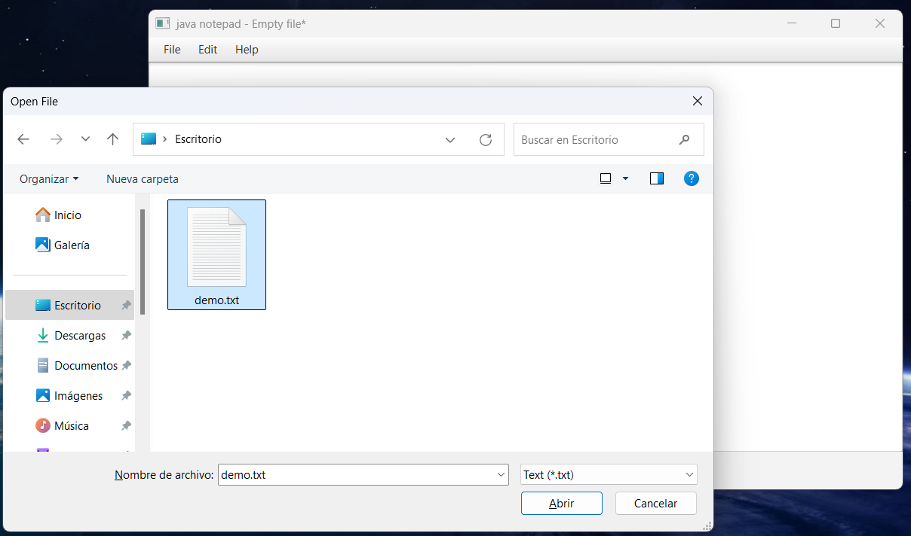

## Bloc de notas hecho en JavaFX

Este bloc de nota está inspirado en el bloc de notas de Windows.

### Requisitos de desarrollo.

* Java 21
* Maven

### ¿Cómo probar la aplicación?

Abres el proyecto y ejecutas el siguiente comando en un nuevo terminal:

```
mvn clean javafx:run 
```

### ¿Cómo construir el proyecto?

**Para constuir el Runtime:**

```
mvn javafx:jlink
```

**Para construir los binarios:**

```
mvn package
```

___

### Screenshot
<p>

</p>

<p>

</p>

<p>

</p>
